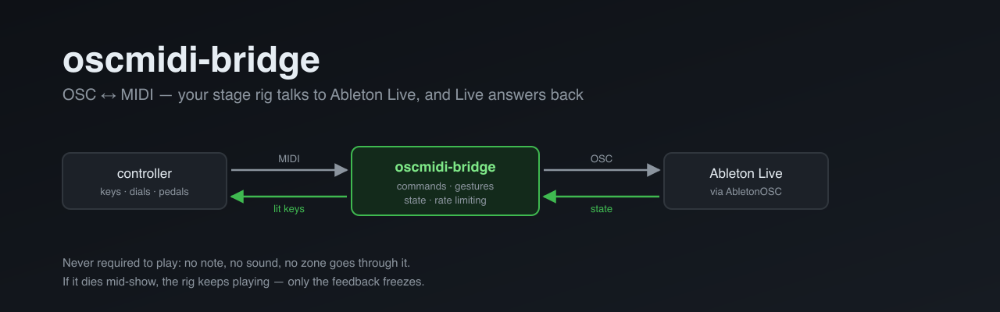

# oscmidi-bridge

**An OSC ↔ MIDI bridge between a stage rig and Ableton Live.** Your keys and knobs
keep sending MIDI exactly as before — and Live now **answers**, so the controller
can show what Live is actually doing instead of firing into the dark.

> **Never required to play.** No note, no sound, no keyboard zone goes through it.
> If it dies mid-show, the rig keeps playing — only the feedback freezes. That is a
> design rule, not an accident, and it shapes every decision below.

---

## Where it sits in the chain

```
   controller  ──MIDI──►  oscmidi-bridge  ──OSC──►  AbletonOSC  ──►  Ableton Live
   keys, dials                  ▲                                          │
                                │                                          │
   lit keys ◄──MIDI CC──────────┤                                          │
   names    ◄──state.json───────┴──────────────OSC (state) ◄───────────────┘
```

It does **not** replace your MIDI setup — it sits beside it. Notes, sounds and
anything that must be instantaneous keep their existing path. The bridge only
carries what benefits from a round trip: transport, scenes, track state, tempo.

## Why it exists

A controller talking to Live has three options, and each costs something:

| | what it costs |
| --- | --- |
| **MIDI + manual mapping** | the mappings live **inside the set** — redone for every project — and MIDI carries **no feedback** |
| **Ableton's own User Remote Script** | global and does send feedback, but the official template has **no Session section** — no scene selection, no scene launch |
| **Generic control-surface scripts** | often unmaintained, and they claim a whole MIDI channel for a handful of functions |

[AbletonOSC](https://github.com/ideoforms/AbletonOSC) mirrors Live's own object
model rather than a hand-picked list of functions, so it ages with Live instead of
against it. This bridge is what lets a MIDI rig speak to it without rewriting the
rig.

## What it does

- **commands** — an incoming CC becomes an OSC message, with explicit typing
  (`12` int, `12.0` float, `"x"` string): AbletonOSC refuses a float track index;
- **gestures** — what a single address cannot express: exclusive solo, next scene,
  toggle playback — computed from the observed state;
- **feedback** — Live's values go back out as CC, with optional rate limiting
  (`every 120ms`), which is what makes VU meters survivable;
- **text** — what MIDI cannot carry (track and scene names) lands in a `state.json`
  the client re-reads;
- **phases** — a named list of OSC messages with no MIDI key of its own: `boot`
  replays whenever Live answers after a silence (a restart, another set loaded),
  `song` is fired at the start of each piece to straighten what playing moved;
- **hot reload** — edit, save, done. A syntax error **does not stop the bridge**:
  the previous configuration stays live and the error is logged with its line
  number. Editing during a rehearsal cannot cut the feedback mid-song.

## Install

```bash
pip install python-rtmidi            # the only dependency
python3 -m oscmidi_bridge --ports    # writes the available MIDI ports into the config
python3 -m oscmidi_bridge --verify   # pre-show check
python3 -m oscmidi_bridge            # run it
```

On the Live side: [AbletonOSC](https://github.com/ideoforms/AbletonOSC) in a Control
Surface slot. Nothing to set per set, per track or per clip.

To run it as a background service, `launchd/oscmidi-bridge.plist.template` has the
three placeholders to fill in.

## The configuration

A text file. One statement per line, no nesting, indentation is cosmetic, `#`
comments to end of line. See [`examples/common.txt`](examples/common.txt).

```sh
channel 16
send  cc 24   /live/song/tap_tempo
send  cc 25   $v+50   /live/song/set/tempo $a.0     # 0-127 → 50-177 bpm
verb  cc 61   scene.next
watch /live/song/get/is_playing  0  ->  cc 100
watch /live/track/get/output_meter_level 0 -> cc 110  every 120ms
text  /live/song/get/track_names    ->  tracks
```

```sh
on boot  /live/track/set/output_routing_type -1 "Ext. Out"   # -1 = the Main track
trigger song  cc 51
```

`$a` is the incoming CC value, `$track` and `$scene` the current selection —
which is how "the selected track", a notion AbletonOSC does not have, becomes
expressible.

A real rig's configuration does not belong in this repository: it describes one
installation. The bridge looks for it via `OSCMIDI_CONFIG`, then a conventional
path, then the bundled example.

## Running several OSC clients at once

AbletonOSC **forces** its reply port and does not answer the source port, so only
one process can receive Live's state. The bridge holds it — it is the one serving
the show — and relays to anyone else:

```sh
fanout  127.0.0.1:11101      # e.g. an MCP server, a monitor, a second tool
```

A client that is not listening never breaks anything.

## Tools

| | |
| --- | --- |
| `tools/gen_catalogue.py` | writes **every** address of the installed AbletonOSC as commented, pre-numbered lines — you uncomment instead of writing |
| `tools/gen_stc_map.py` | translates the Selected Track Control dialect, keeping its own note and CC numbers, so it can be swapped out without touching the controller |
| `patches/` | an AbletonOSC patch making the Main track (index `-1`) and the Cue bus (`-2`) addressable — neither is in `song.tracks`, and a negative index otherwise resolves silently to a regular track ([upstream PR](https://github.com/ideoforms/AbletonOSC/pull/218)) |

## Licence

MIT.
